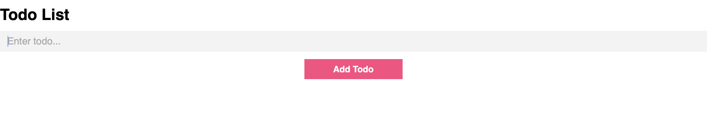
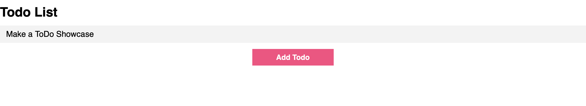
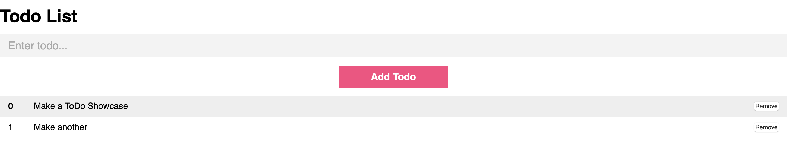

# Todo Angular App

## Overview
This is a simple ToDo angular app. Users can add or remove tasks. 

## Table of Contents
- [Installation](#installation)
- [Features](#features)
- [Screenshots](#screenshots)
- [Contributing](#contributing)

## Installation

1. **Clone the repository:**
   ```
   git clone https://github.com/TheDude-creator/angular-app.git
   ```
2. **Navigate to the project directory:**

   ```
   cd angular-app
   ```

3. **Install dependencies:**

   ```
   npm install
   ```

4. **Run the project:**

   ```
   npm run start
   ```

## Features 

- Add Tasks
- Remove Tasks
- Auto Numerated

## Screenshots





## Contributing

Contributions are welcome! If you'd like to contribute, please follow these steps:

1. Fork the repository. Create your feature branch (git checkout -b feature/YourFeature).
2. Commit your changes (git commit -m 'Add some feature').
3. Push to the branch (git push origin feature/YourFeature).
4. Open a pull request.
